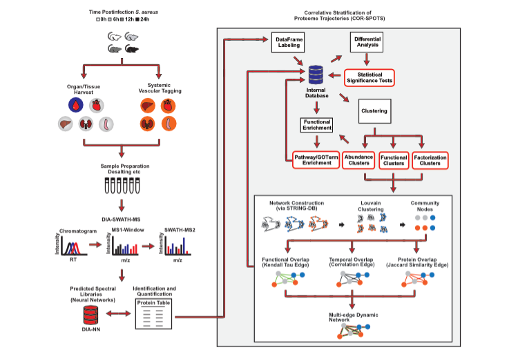

# Organ dysfunction in sepsis is preceded by coordinated proteome remodeling of the vascular surfaces

This repository includes all the source code, tests and notebooks used to generate the main figures shown in the manuscript (Sorrentino, Esko, & Gomez et al. 2021). The Correlative Stratification Of Proteome Trajectories workflow is outlined here.

## Repository Structure

* pkg

This directory contains all python code used in the COR-SPOTS workflow.

* Notebooks

Implementation of COR-SPOTS procedures can be found in the numerically ordered notebooks. Package requirements are listed in requirments.txt.

## Notes to the reader

We do not provide all of the data in this repository. This repository acts as a representaion of produces taken during the COR-SPOTS workflow and allows for analogous studies to be conducted. Please contact us regarding questions about the data for this study.

Public query of STRING-DB through HTTP requests can take some time. As stated in the STRING-DB docs you may download the entire dataset by signing the academic license agreement.